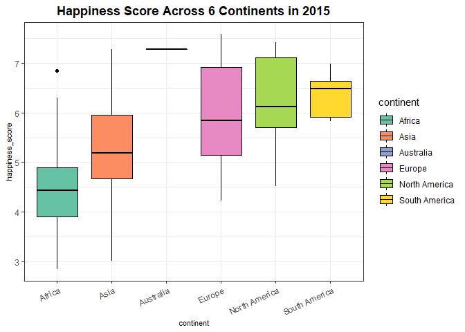
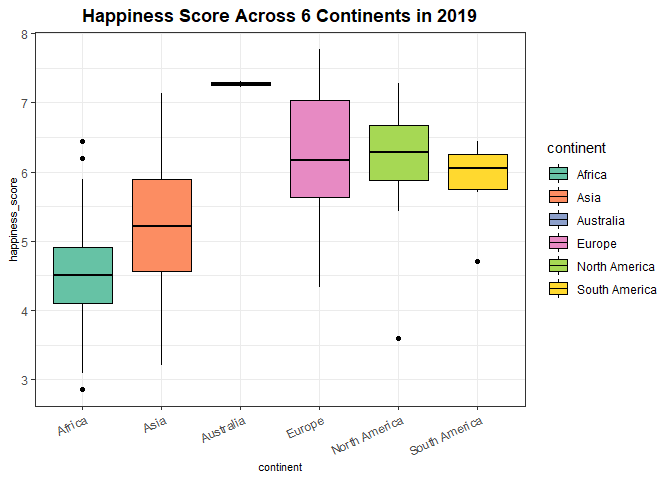
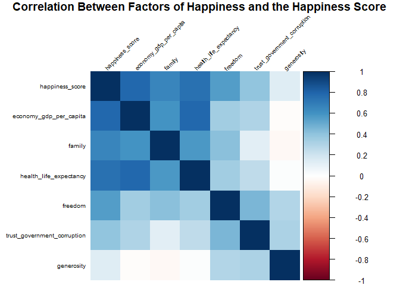
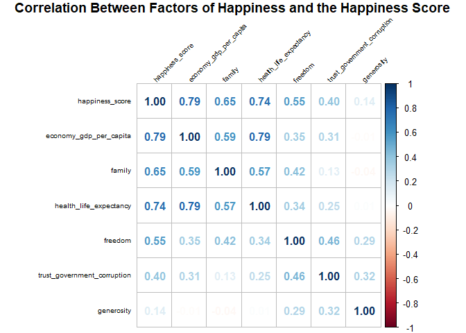
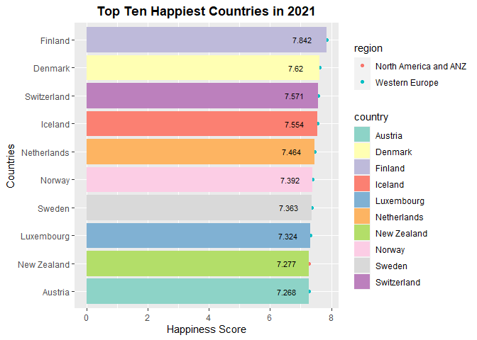
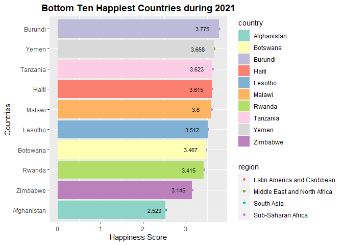
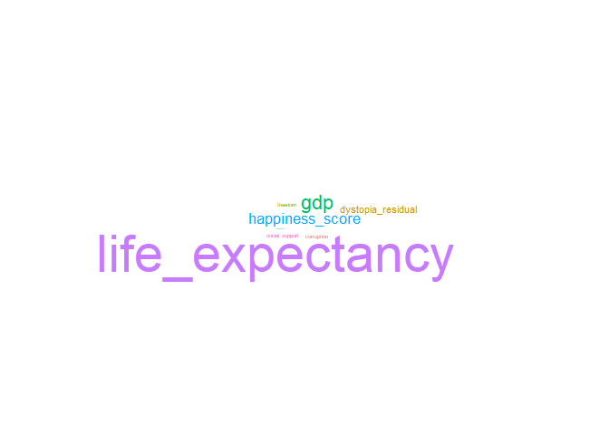

## Overview of my focus 
After exploring the data by looking at its structure through functions like `glimpse`, `summary`, and `naniar::miss_var_summary()`, I analyzed 6 continents and their happiness scores between 2015 and 2019. In addition, I observed the relationship between happiness factors and their happiness overall. Just out of interest, I also took a look at the 2021 report on Happiness and did a short analysis at the end.

## Load the Libraries 

```r
library(ggwordcloud)
```

```
## Loading required package: ggplot2
```

```r
library(ggplot2)
library(tidyverse)
```

```
## -- Attaching packages --------------------------------------- tidyverse 1.3.1 --
```

```
## v tibble  3.1.6     v dplyr   1.0.8
## v tidyr   1.2.0     v stringr 1.4.0
## v readr   2.1.2     v forcats 0.5.1
## v purrr   0.3.4
```

```
## -- Conflicts ------------------------------------------ tidyverse_conflicts() --
## x dplyr::filter() masks stats::filter()
## x dplyr::lag()    masks stats::lag()
```

```r
library(RColorBrewer)
library(paletteer)
library(janitor)
```

```
## 
## Attaching package: 'janitor'
```

```
## The following objects are masked from 'package:stats':
## 
##     chisq.test, fisher.test
```

```r
library(ggthemes)
library(corrplot)
```

```
## corrplot 0.92 loaded
```


```r
options(scipen=999)
```

## Load and Clean the Data 

```r
happiness_2015 <- readr::read_csv("data/2015.csv")%>% 
  clean_names()
```

```
## Rows: 158 Columns: 12
## -- Column specification --------------------------------------------------------
## Delimiter: ","
## chr  (2): Country, Region
## dbl (10): Happiness Rank, Happiness Score, Standard Error, Economy (GDP per ...
## 
## i Use `spec()` to retrieve the full column specification for this data.
## i Specify the column types or set `show_col_types = FALSE` to quiet this message.
```

```r
happiness_2016 <- readr::read_csv("data/2016.csv")%>% 
  clean_names()
```

```
## Rows: 157 Columns: 13
## -- Column specification --------------------------------------------------------
## Delimiter: ","
## chr  (2): Country, Region
## dbl (11): Happiness Rank, Happiness Score, Lower Confidence Interval, Upper ...
## 
## i Use `spec()` to retrieve the full column specification for this data.
## i Specify the column types or set `show_col_types = FALSE` to quiet this message.
```

```r
happiness_2017 <- readr::read_csv("data/2017.csv")%>% 
  clean_names()
```

```
## Rows: 155 Columns: 12
## -- Column specification --------------------------------------------------------
## Delimiter: ","
## chr  (1): Country
## dbl (11): Happiness.Rank, Happiness.Score, Whisker.high, Whisker.low, Econom...
## 
## i Use `spec()` to retrieve the full column specification for this data.
## i Specify the column types or set `show_col_types = FALSE` to quiet this message.
```

```r
happiness_2018 <- readr::read_csv("data/2018.csv")%>% 
  clean_names()
```

```
## Rows: 156 Columns: 9
## -- Column specification --------------------------------------------------------
## Delimiter: ","
## chr (2): Country or region, Perceptions of corruption
## dbl (7): Overall rank, Score, GDP per capita, Social support, Healthy life e...
## 
## i Use `spec()` to retrieve the full column specification for this data.
## i Specify the column types or set `show_col_types = FALSE` to quiet this message.
```

```r
happiness_2019 <- readr::read_csv("data/2019.csv")%>% 
  clean_names()
```

```
## Rows: 156 Columns: 9
## -- Column specification --------------------------------------------------------
## Delimiter: ","
## chr (1): Country or region
## dbl (8): Overall rank, Score, GDP per capita, Social support, Healthy life e...
## 
## i Use `spec()` to retrieve the full column specification for this data.
## i Specify the column types or set `show_col_types = FALSE` to quiet this message.
```

## Merging Data Frames
**Add year**

```r
# Add year
happiness_2015_join <- happiness_2015 %>% 
  mutate(year = case_when(country != "NA" ~ "2015"))
happiness_2016_join <- happiness_2016 %>% 
  mutate(year = case_when(country != "NA" ~ "2016"))
happiness_2017_join <- happiness_2017 %>% 
  mutate(year = case_when(country != "NA" ~ "2017"))
happiness_2018_join <- happiness_2018 %>% 
  mutate(year = case_when(country_or_region != "NA" ~ "2018"))
happiness_2019_join <- happiness_2019 %>% 
  mutate(year = case_when(country_or_region != "NA" ~ "2019"))
```

**Change column names**

```r
#Change Column names
happiness_2015_join <- happiness_2015_join %>% 
  rename(country_or_region = country)

happiness_2016_join <- happiness_2016_join %>% 
  rename(country_or_region = country)

happiness_2017_join <- happiness_2017_join %>% 
  rename(country_or_region = country)

happiness_2018_join <- happiness_2018_join %>% 
  rename(happiness_rank = overall_rank,
         happiness_score = score,
         economy_gdp_per_capita = gdp_per_capita,
         family = social_support,
         health_life_expectancy = healthy_life_expectancy,
         freedom = freedom_to_make_life_choices,
         trust_government_corruption = perceptions_of_corruption)

happiness_2019_join <- happiness_2019_join %>% 
  rename(happiness_rank = overall_rank,
         happiness_score = score,
         economy_gdp_per_capita = gdp_per_capita,
         family = social_support,
         health_life_expectancy = healthy_life_expectancy,
         freedom = freedom_to_make_life_choices,
         trust_government_corruption = perceptions_of_corruption)
```

**Merge data frames together**

```r
#merge data frames together
#thank you Joel
happiness_2018_join$trust_government_corruption <- as.numeric(happiness_2018_join$trust_government_corruption)
```

```
## Warning: NAs introduced by coercion
```


```r
complete_happiness <- bind_rows(happiness_2015_join, happiness_2016_join, happiness_2017_join, happiness_2018_join, happiness_2019_join) #bind the data frames

complete_happiness <- complete_happiness %>% 
  select(-region, -standard_error, -dystopia_residual, -lower_confidence_interval, -upper_confidence_interval, -whisker_high, -whisker_low) #remove unwanted columns
```


## Exploring the Data
**Here, we’re interested in understanding what kind of data we’re going to be working with by utilizing several functions to observe its structure.**


```r
summary(complete_happiness)
```

```
##  country_or_region  happiness_rank  happiness_score economy_gdp_per_capita
##  Length:782         Min.   :  1.0   Min.   :2.693   Min.   :0.0000        
##  Class :character   1st Qu.: 40.0   1st Qu.:4.510   1st Qu.:0.6065        
##  Mode  :character   Median : 79.0   Median :5.322   Median :0.9822        
##                     Mean   : 78.7   Mean   :5.379   Mean   :0.9160        
##                     3rd Qu.:118.0   3rd Qu.:6.189   3rd Qu.:1.2362        
##                     Max.   :158.0   Max.   :7.769   Max.   :2.0960        
##                                                                           
##      family       health_life_expectancy    freedom      
##  Min.   :0.0000   Min.   :0.0000         Min.   :0.0000  
##  1st Qu.:0.8694   1st Qu.:0.4402         1st Qu.:0.3098  
##  Median :1.1247   Median :0.6473         Median :0.4310  
##  Mean   :1.0784   Mean   :0.6124         Mean   :0.4111  
##  3rd Qu.:1.3273   3rd Qu.:0.8080         3rd Qu.:0.5310  
##  Max.   :1.6440   Max.   :1.1410         Max.   :0.7240  
##                                                          
##  trust_government_corruption   generosity         year          
##  Min.   :0.0000              Min.   :0.0000   Length:782        
##  1st Qu.:0.0540              1st Qu.:0.1300   Class :character  
##  Median :0.0910              Median :0.2020   Mode  :character  
##  Mean   :0.1254              Mean   :0.2186                     
##  3rd Qu.:0.1560              3rd Qu.:0.2788                     
##  Max.   :0.5519              Max.   :0.8381                     
##  NA's   :1
```


```r
glimpse(complete_happiness)
```

```
## Rows: 782
## Columns: 10
## $ country_or_region           <chr> "Switzerland", "Iceland", "Denmark", "Norw~
## $ happiness_rank              <dbl> 1, 2, 3, 4, 5, 6, 7, 8, 9, 10, 11, 12, 13,~
## $ happiness_score             <dbl> 7.587, 7.561, 7.527, 7.522, 7.427, 7.406, ~
## $ economy_gdp_per_capita      <dbl> 1.39651, 1.30232, 1.32548, 1.45900, 1.3262~
## $ family                      <dbl> 1.34951, 1.40223, 1.36058, 1.33095, 1.3226~
## $ health_life_expectancy      <dbl> 0.94143, 0.94784, 0.87464, 0.88521, 0.9056~
## $ freedom                     <dbl> 0.66557, 0.62877, 0.64938, 0.66973, 0.6329~
## $ trust_government_corruption <dbl> 0.41978, 0.14145, 0.48357, 0.36503, 0.3295~
## $ generosity                  <dbl> 0.29678, 0.43630, 0.34139, 0.34699, 0.4581~
## $ year                        <chr> "2015", "2015", "2015", "2015", "2015", "2~
```


```r
complete_happiness %>%
  naniar::miss_var_summary()
```

```
## # A tibble: 10 x 3
##    variable                    n_miss pct_miss
##    <chr>                        <int>    <dbl>
##  1 trust_government_corruption      1    0.128
##  2 country_or_region                0    0    
##  3 happiness_rank                   0    0    
##  4 happiness_score                  0    0    
##  5 economy_gdp_per_capita           0    0    
##  6 family                           0    0    
##  7 health_life_expectancy           0    0    
##  8 freedom                          0    0    
##  9 generosity                       0    0    
## 10 year                             0    0
```


```r
names(complete_happiness)
```

```
##  [1] "country_or_region"           "happiness_rank"             
##  [3] "happiness_score"             "economy_gdp_per_capita"     
##  [5] "family"                      "health_life_expectancy"     
##  [7] "freedom"                     "trust_government_corruption"
##  [9] "generosity"                  "year"
```

**Creating specific columns for six continents in 2015**

*Note: Although Antarctica is considered a continent, there is no native human population, but instead, a transient population which didn’t allow for a proper collection of data according to the factors within the dataset. It also has no government (with the few exceptions of international agreements) and no established economy besides offshore trading of fish and tourism.*

```r
happiness_2015_join$continent <- NA

happiness_2015_join$continent[which(happiness_2015_join$country_or_region %in% c("New Zealand", "Australia"))] <- "Australia"

happiness_2015_join$continent[which(is.na(happiness_2015_join$continent))] <- "Africa"

happiness_2015_join$continent[which(happiness_2015_join$country_or_region %in% c("Israel", "United Arab Emirates", "Singapore", "Thailand", "Taiwan Province of China", "Qatar", "Saudi Arabia", "Kuwait", "Bahrain", "Malaysia", "Uzbekistan", "Japan", "South Korea", "Turkmenistan", "Kazakhstan", "Turkey", "Hong Kong S.A.R., China", "Philippines", "Jordan", "China", "Pakistan", "Indonesia", "Azerbaijan", "Lebanon", "Vietnam", "Tajikistan", "Bhutan", "Kyrgyzstan", "Nepal", "Mongolia", "Palestinian Territories", "Iran", "Bangladesh", "Myanmar", "Iraq", "Sri Lanka", "Armenia", "India", "Georgia", "Cambodia", "Afghanistan", "Yemen", "Syria"))] <- "Asia"

happiness_2015_join$continent[which(happiness_2015_join$country_or_region %in% c("Norway", "Denmark", "Iceland", "Switzerland", "Finland", "Netherlands", "Sweden", "Austria", "Ireland", "Germany", "Belgium", "Luxembourg", "United Kingdom", "Czech Republic", "Malta", "France", "Spain", "Slovakia", "Poland", "Italy", "Russia", "Lithuania", "Latvia", "Moldova", "Romania", "Slovenia", "North Cyprus", "Cyprus", "Estonia", "Belarus", "Serbia", "Hungary", "Croatia", "Kosovo", "Montenegro", "Greece", "Portugal", "Bosnia and Herzegovina", "Macedonia", "Bulgaria", "Albania", "Ukraine"))] <- "Europe"

happiness_2015_join$continent[which(happiness_2015_join$country_or_region %in% c("Canada", "Costa Rica", "United States", "Mexico", "Panama","Trinidad and Tobago", "El Salvador", "Belize", "Guatemala", "Jamaica", "Nicaragua", "Dominican Republic", "Honduras", "Haiti"))] <- "North America"

happiness_2015_join$continent[which(happiness_2015_join$country_or_region %in% c("Chile", "Brazil", "Argentina", "Uruguay", "Colombia", "Ecuador", "Bolivia", "Peru","Paraguay", "Venezuela"))] <- "South America"

# moving the continent column's position in the dataset to the second column

happiness_2015_join <- happiness_2015_join %>% select(country_or_region,continent, everything())

# changing Continent column to factor

happiness_2015_join$continent <- as.factor(happiness_2015_join$continent)

str(happiness_2015_join)
```

```
## tibble [158 x 14] (S3: tbl_df/tbl/data.frame)
##  $ country_or_region          : chr [1:158] "Switzerland" "Iceland" "Denmark" "Norway" ...
##  $ continent                  : Factor w/ 6 levels "Africa","Asia",..: 4 4 4 4 5 4 4 4 3 3 ...
##  $ region                     : chr [1:158] "Western Europe" "Western Europe" "Western Europe" "Western Europe" ...
##  $ happiness_rank             : num [1:158] 1 2 3 4 5 6 7 8 9 10 ...
##  $ happiness_score            : num [1:158] 7.59 7.56 7.53 7.52 7.43 ...
##  $ standard_error             : num [1:158] 0.0341 0.0488 0.0333 0.0388 0.0355 ...
##  $ economy_gdp_per_capita     : num [1:158] 1.4 1.3 1.33 1.46 1.33 ...
##  $ family                     : num [1:158] 1.35 1.4 1.36 1.33 1.32 ...
##  $ health_life_expectancy     : num [1:158] 0.941 0.948 0.875 0.885 0.906 ...
##  $ freedom                    : num [1:158] 0.666 0.629 0.649 0.67 0.633 ...
##  $ trust_government_corruption: num [1:158] 0.42 0.141 0.484 0.365 0.33 ...
##  $ generosity                 : num [1:158] 0.297 0.436 0.341 0.347 0.458 ...
##  $ dystopia_residual          : num [1:158] 2.52 2.7 2.49 2.47 2.45 ...
##  $ year                       : chr [1:158] "2015" "2015" "2015" "2015" ...
```

**Creating specific columns for six continents in 2019.**

```r
happiness_2019_join$continent <- NA

happiness_2019_join$continent[which(happiness_2019_join$country_or_region %in% c("New Zealand", "Australia"))] <- "Australia"

happiness_2019_join$continent[which(is.na(happiness_2019_join$continent))] <- "Africa"

happiness_2019_join$continent[which(happiness_2019_join$country_or_region %in% c("Israel", "United Arab Emirates", "Singapore", "Thailand", "Taiwan Province of China", "Qatar", "Saudi Arabia", "Kuwait", "Bahrain", "Malaysia", "Uzbekistan", "Japan", "South Korea", "Turkmenistan", "Kazakhstan", "Turkey", "Hong Kong S.A.R., China", "Philippines", "Jordan", "China", "Pakistan", "Indonesia", "Azerbaijan", "Lebanon", "Vietnam", "Tajikistan", "Bhutan", "Kyrgyzstan", "Nepal", "Mongolia", "Palestinian Territories","Iran", "Bangladesh", "Myanmar", "Iraq", "Sri Lanka", "Armenia", "India", "Georgia", "Cambodia", "Afghanistan", "Yemen", "Syria"))] <- "Asia"

happiness_2019_join$continent[which(happiness_2019_join$country_or_region %in% c("Norway", "Denmark", "Iceland", "Switzerland", "Finland","Netherlands", "Sweden", "Austria", "Ireland", "Germany", "Belgium", "Luxembourg", "United Kingdom", "Czech Republic", "Malta", "France", "Spain", "Slovakia", "Poland", "Italy", "Russia", "Lithuania", "Latvia", "Moldova", "Romania", "Slovenia", "North Cyprus", "Cyprus", "Estonia", "Belarus", "Serbia", "Hungary", "Croatia", "Kosovo", "Montenegro", "Greece", "Portugal", "Bosnia and Herzegovina", "Macedonia", "Bulgaria", "Albania", "Ukraine"))] <- "Europe"

happiness_2019_join$continent[which(happiness_2019_join$country_or_region %in% c("Canada", "Costa Rica", "United States", "Mexico", "Panama","Trinidad and Tobago", "El Salvador", "Belize", "Guatemala", "Jamaica", "Nicaragua", "Dominican Republic", "Honduras", "Haiti"))] <- "North America"

happiness_2019_join$continent[which(happiness_2019_join$country_or_region %in% c("Chile", "Brazil", "Argentina", "Uruguay", "Colombia", "Ecuador", "Bolivia", "Peru", "Paraguay", "Venezuela"))] <- "South America"

happiness_2019_join$continent <- as.factor(happiness_2019_join$continent)

str(happiness_2019_join)
```

```
## tibble [156 x 11] (S3: tbl_df/tbl/data.frame)
##  $ happiness_rank             : num [1:156] 1 2 3 4 5 6 7 8 9 10 ...
##  $ country_or_region          : chr [1:156] "Finland" "Denmark" "Norway" "Iceland" ...
##  $ happiness_score            : num [1:156] 7.77 7.6 7.55 7.49 7.49 ...
##  $ economy_gdp_per_capita     : num [1:156] 1.34 1.38 1.49 1.38 1.4 ...
##  $ family                     : num [1:156] 1.59 1.57 1.58 1.62 1.52 ...
##  $ health_life_expectancy     : num [1:156] 0.986 0.996 1.028 1.026 0.999 ...
##  $ freedom                    : num [1:156] 0.596 0.592 0.603 0.591 0.557 0.572 0.574 0.585 0.584 0.532 ...
##  $ generosity                 : num [1:156] 0.153 0.252 0.271 0.354 0.322 0.263 0.267 0.33 0.285 0.244 ...
##  $ trust_government_corruption: num [1:156] 0.393 0.41 0.341 0.118 0.298 0.343 0.373 0.38 0.308 0.226 ...
##  $ year                       : chr [1:156] "2019" "2019" "2019" "2019" ...
##  $ continent                  : Factor w/ 6 levels "Africa","Asia",..: 4 4 4 4 4 4 4 3 5 4 ...
```

**Creating specific columns for six continents in `complete_happiness`.**

```r
complete_happiness$continent <- NA

complete_happiness$continent[which(complete_happiness$country_or_region %in% c("New Zealand", "Australia"))] <- "Australia"

complete_happiness$continent[which(is.na(complete_happiness$continent))] <- "Africa"

complete_happiness$continent[which(complete_happiness$country_or_region %in% c("Israel", "United Arab Emirates", "Singapore", "Thailand", "Taiwan Province of China", "Qatar", "Saudi Arabia", "Kuwait", "Bahrain", "Malaysia", "Uzbekistan", "Japan", "South Korea", "Turkmenistan", "Kazakhstan", "Turkey", "Hong Kong S.A.R., China", "Philippines", "Jordan", "China", "Pakistan", "Indonesia", "Azerbaijan", "Lebanon", "Vietnam", "Tajikistan", "Bhutan", "Kyrgyzstan", "Nepal", "Mongolia", "Palestinian Territories", "Iran", "Bangladesh", "Myanmar", "Iraq", "Sri Lanka", "Armenia", "India", "Georgia", "Cambodia", "Afghanistan", "Yemen", "Syria"))] <- "Asia"

complete_happiness$continent[which(complete_happiness$country_or_region %in% c("Norway", "Denmark", "Iceland", "Switzerland", "Finland", "Netherlands", "Sweden", "Austria", "Ireland", "Germany", "Belgium", "Luxembourg", "United Kingdom", "Czech Republic", "Malta", "France", "Spain", "Slovakia", "Poland", "Italy", "Russia", "Lithuania", "Latvia", "Moldova", "Romania", "Slovenia", "North Cyprus", "Cyprus", "Estonia", "Belarus", "Serbia", "Hungary", "Croatia", "Kosovo", "Montenegro", "Greece", "Portugal", "Bosnia and Herzegovina", "Macedonia", "Bulgaria", "Albania", "Ukraine"))] <- "Europe"

complete_happiness$continent[which(complete_happiness$country_or_region %in% c("Canada", "Costa Rica", "United States", "Mexico", "Panama","Trinidad and Tobago", "El Salvador", "Belize", "Guatemala", "Jamaica", "Nicaragua", "Dominican Republic", "Honduras", "Haiti"))] <- "North America"

complete_happiness$continent[which(complete_happiness$country_or_region %in% c("Chile", "Brazil", "Argentina", "Uruguay", "Colombia", "Ecuador", "Bolivia", "Peru","Paraguay", "Venezuela"))] <- "South America"

complete_happiness$continent <- as.factor(complete_happiness$continent)

str(complete_happiness)
```

```
## tibble [782 x 11] (S3: tbl_df/tbl/data.frame)
##  $ country_or_region          : chr [1:782] "Switzerland" "Iceland" "Denmark" "Norway" ...
##  $ happiness_rank             : num [1:782] 1 2 3 4 5 6 7 8 9 10 ...
##  $ happiness_score            : num [1:782] 7.59 7.56 7.53 7.52 7.43 ...
##  $ economy_gdp_per_capita     : num [1:782] 1.4 1.3 1.33 1.46 1.33 ...
##  $ family                     : num [1:782] 1.35 1.4 1.36 1.33 1.32 ...
##  $ health_life_expectancy     : num [1:782] 0.941 0.948 0.875 0.885 0.906 ...
##  $ freedom                    : num [1:782] 0.666 0.629 0.649 0.67 0.633 ...
##  $ trust_government_corruption: num [1:782] 0.42 0.141 0.484 0.365 0.33 ...
##  $ generosity                 : num [1:782] 0.297 0.436 0.341 0.347 0.458 ...
##  $ year                       : chr [1:782] "2015" "2015" "2015" "2015" ...
##  $ continent                  : Factor w/ 6 levels "Africa","Asia",..: 4 4 4 4 5 4 4 4 3 3 ...
```


## Happiness Score by Continents (with Boxplots)

**Comparing `Happiness_Score` across Asia, Europe, South America, North America, Australia, and Africa for 2015**
We’re going to look at how each continent’s happiness score differ by creating a **box plot.**

```r
happiness_2015_join %>%
  ggplot(aes(x = continent, y = happiness_score, fill= continent)) +
  geom_boxplot(color= "black", na.rm=TRUE) +
  theme_bw() +
  theme(axis.title = element_text(size = (8)))+
  theme(axis.text.x = element_text(angle = 25, hjust = 1))+
  ggtitle("Happiness Score Across 6 Continents in 2015")+
  theme(plot.title=element_text(face="bold",hjust=0.5))+
  scale_fill_brewer(palette = "Set2")
```

<!-- -->


**Comparing `Happiness_Score` across Asia, Europe, South America, North America, Australia, and Africa for 2019**

```r
happiness_2019_join %>%
  ggplot(aes(x = continent, y = happiness_score, fill= continent)) +
  geom_boxplot(color= "black", na.rm=TRUE) +
  theme_bw() +
  theme(axis.title = element_text(size = (8)))+
  theme(axis.text.x = element_text(angle = 25, hjust = 1))+
  ggtitle("Happiness Score Across 6 Continents in 2019")+
  theme(plot.title=element_text(face="bold",hjust=0.5))+
  scale_fill_brewer(palette = "Set2")
```

<!-- -->

As one can see, both 2015 and 2019 *relatively* have the same distribution of happiness scores. However, Europe has increased its median of its score above 6.0 and South America has decreased its happiness score by about 0.5 as it nears a score of 6.0 for its median. Unlike 2015, there are a few more outliers demonstrates in the boxplot of 2019.

## Analyzing mean of happiness factors compared to overall happiness score (with facet_wrap)

**Finding the average values of happiness variables for each continent and viewing its relationship with their average happiness score.**

```r
avg_happiness <-complete_happiness %>%
  group_by(continent) %>%
  summarise(across(happiness_score:generosity, list(mean), na.rm=T))%>%       
  head(n=6)
avg_happiness
```

```
## # A tibble: 6 x 8
##   continent     happiness_score_1 economy_gdp_per_cap~ family_1 health_life_exp~
##   <fct>                     <dbl>                <dbl>    <dbl>            <dbl>
## 1 Africa                     4.43                0.563    0.876            0.362
## 2 Asia                       5.24                0.963    1.04             0.649
## 3 Australia                  7.29                1.36     1.42             0.903
## 4 Europe                     6.13                1.23     1.27             0.808
## 5 North America              6.10                0.951    1.16             0.684
## 6 South America              6.12                1.00     1.25             0.706
## # ... with 3 more variables: freedom_1 <dbl>,
## #   trust_government_corruption_1 <dbl>, generosity_1 <dbl>
```

*Renaming Columns*

```r
avg_happiness <- avg_happiness %>%
  rename(happiness_score=happiness_score_1, economy= economy_gdp_per_capita_1, family=family_1, life_expectancy=health_life_expectancy_1, freedom=freedom_1, trust=trust_government_corruption_1, generosity=generosity_1)
avg_happiness
```

```
## # A tibble: 6 x 8
##   continent     happiness_score economy family life_expectancy freedom  trust
##   <fct>                   <dbl>   <dbl>  <dbl>           <dbl>   <dbl>  <dbl>
## 1 Africa                   4.43   0.563  0.876           0.362   0.360 0.111 
## 2 Asia                     5.24   0.963  1.04            0.649   0.418 0.134 
## 3 Australia                7.29   1.36   1.42            0.903   0.611 0.357 
## 4 Europe                   6.13   1.23   1.27            0.808   0.421 0.135 
## 5 North America            6.10   0.951  1.16            0.684   0.478 0.114 
## 6 South America            6.12   1.00   1.25            0.706   0.458 0.0913
## # ... with 1 more variable: generosity <dbl>
```

Using **facet_wrap** we can get a better interpretation of how the variables contribute to happiness for 2015 and 2019. This will oversee the 6 continents we previously looked at.


## Correlation between happiness factors from 2015-2019 (with Correlation Map)

**First, we’re going to make sure that we only use numerical variables to view the correlation.**

```r
str(complete_happiness)
```

```
## tibble [782 x 11] (S3: tbl_df/tbl/data.frame)
##  $ country_or_region          : chr [1:782] "Switzerland" "Iceland" "Denmark" "Norway" ...
##  $ happiness_rank             : num [1:782] 1 2 3 4 5 6 7 8 9 10 ...
##  $ happiness_score            : num [1:782] 7.59 7.56 7.53 7.52 7.43 ...
##  $ economy_gdp_per_capita     : num [1:782] 1.4 1.3 1.33 1.46 1.33 ...
##  $ family                     : num [1:782] 1.35 1.4 1.36 1.33 1.32 ...
##  $ health_life_expectancy     : num [1:782] 0.941 0.948 0.875 0.885 0.906 ...
##  $ freedom                    : num [1:782] 0.666 0.629 0.649 0.67 0.633 ...
##  $ trust_government_corruption: num [1:782] 0.42 0.141 0.484 0.365 0.33 ...
##  $ generosity                 : num [1:782] 0.297 0.436 0.341 0.347 0.458 ...
##  $ year                       : chr [1:782] "2015" "2015" "2015" "2015" ...
##  $ continent                  : Factor w/ 6 levels "Africa","Asia",..: 4 4 4 4 5 4 4 4 3 3 ...
```


```r
#selecting only numerical columns in the dataset
complete_happiness2 <- subset(complete_happiness, select=c("happiness_rank", "happiness_score", "economy_gdp_per_capita", "family", "health_life_expectancy", "freedom", "trust_government_corruption", "generosity"))
```

**What factors have a weak relationship with happiness? What about strong? Overall, we’re trying to see what factors drive a higher happiness score in our data.**

```r
#utilizing newly installed package called corrplot to view correlations
cor_2015_to_2019 <- cor(complete_happiness2[,-1],use="complete.obs")
cor_2015_to_2019
```

```
##                             happiness_score economy_gdp_per_capita      family
## happiness_score                   1.0000000             0.78971948  0.65124553
## economy_gdp_per_capita            0.7897195             1.00000000  0.59288930
## family                            0.6512455             0.59288930  1.00000000
## health_life_expectancy            0.7428428             0.78775200  0.57325232
## freedom                           0.5533649             0.34561461  0.41979543
## trust_government_corruption       0.3984179             0.30630743  0.12640136
## generosity                        0.1381421            -0.01364567 -0.03759691
##                             health_life_expectancy   freedom
## happiness_score                         0.74284279 0.5533649
## economy_gdp_per_capita                  0.78775200 0.3456146
## family                                  0.57325232 0.4197954
## health_life_expectancy                  1.00000000 0.3411552
## freedom                                 0.34115521 1.0000000
## trust_government_corruption             0.25051201 0.4595933
## generosity                              0.01071815 0.2905636
##                             trust_government_corruption  generosity
## happiness_score                               0.3984179  0.13814208
## economy_gdp_per_capita                        0.3063074 -0.01364567
## family                                        0.1264014 -0.03759691
## health_life_expectancy                        0.2505120  0.01071815
## freedom                                       0.4595933  0.29056363
## trust_government_corruption                   1.0000000  0.31891961
## generosity                                    0.3189196  1.00000000
```


```r
#using method "color"
corrplot(cor_2015_to_2019, method="color", tl.col = 'black', cl.ratio = 0.5, tl.srt = 45, title="Correlation Between Factors of Happiness and the Happiness Score", mar=c(0,0,1,0), tl.cex = 0.60)
```

<!-- -->


```r
#using method "number"
corrplot(cor_2015_to_2019, method = "number", tl.col = 'black', cl.ratio = 0.2, tl.srt = 45, title="Correlation Between Factors of Happiness and the Happiness Score", mar=c(0,0,1,0), tl.cex = 0.60)
```

<!-- -->

-Using only numerical variables and excluding the country/region and continent, I got to see that **family, life expectancy, and economy (GDP)** were the factors that greatly contributed to the happiness score or in other words, had a positive relationship.

-Surprisingly, **generosity** had little to no relationship to happiness.

-It makes sense that a better economy (greater influx in money) will have a **positive effect** on happiness; therefore, being able to live longer (likely due to easier access to healthcare/aid), and have support from family.


## Viewing the 2021 Happiness Report Data
Lastly, out of curiosity I wanted to see how happiness between countries have changed in the most recent dataset of 2021 especially with the COVID-19 Pandemic taken into account.

**Loading and Cleaning the Data**

```r
happiness_2021 <- readr::read_csv("data/2021.csv")%>%clean_names()
```

```
## Rows: 149 Columns: 20
## -- Column specification --------------------------------------------------------
## Delimiter: ","
## chr  (2): Country name, Regional indicator
## dbl (18): Ladder score, Standard error of ladder score, upperwhisker, lowerw...
## 
## i Use `spec()` to retrieve the full column specification for this data.
## i Specify the column types or set `show_col_types = FALSE` to quiet this message.
```


```r
#choosing specific columns to focus on in analysis 
happiness_2021 <- subset(happiness_2021, select=c("country_name", "regional_indicator", "ladder_score", "logged_gdp_per_capita", "social_support", "healthy_life_expectancy", "freedom_to_make_life_choices", "generosity", "perceptions_of_corruption", "dystopia_residual"))
happiness_2021
```

```
## # A tibble: 149 x 10
##    country_name regional_indicator  ladder_score logged_gdp_per_~ social_support
##    <chr>        <chr>                      <dbl>            <dbl>          <dbl>
##  1 Finland      Western Europe              7.84             10.8          0.954
##  2 Denmark      Western Europe              7.62             10.9          0.954
##  3 Switzerland  Western Europe              7.57             11.1          0.942
##  4 Iceland      Western Europe              7.55             10.9          0.983
##  5 Netherlands  Western Europe              7.46             10.9          0.942
##  6 Norway       Western Europe              7.39             11.1          0.954
##  7 Sweden       Western Europe              7.36             10.9          0.934
##  8 Luxembourg   Western Europe              7.32             11.6          0.908
##  9 New Zealand  North America and ~         7.28             10.6          0.948
## 10 Austria      Western Europe              7.27             10.9          0.934
## # ... with 139 more rows, and 5 more variables: healthy_life_expectancy <dbl>,
## #   freedom_to_make_life_choices <dbl>, generosity <dbl>,
## #   perceptions_of_corruption <dbl>, dystopia_residual <dbl>
```

*Renaming Column Names*

```r
#renaming column names
happiness_2021 <- happiness_2021 %>%
  dplyr::rename(country=country_name, region=regional_indicator, happiness_score=ladder_score, gdp=logged_gdp_per_capita, life_expectancy= healthy_life_expectancy, freedom=freedom_to_make_life_choices, corruption=perceptions_of_corruption)
```

Now, the interesting part! I’ll be seeing both the top 10 most happiest countries as well as the 10 least happiest countries so that we can compare the two.

**Viewing top 10 happiest countries in 2021**

```r
happiness_2021 %>% 
  arrange(desc(happiness_score)) %>%
  head(10) %>% 
  ggplot(aes(x = happiness_score, y = reorder(country, happiness_score),  fill = country)) +
  geom_point(aes(color = region)) +
  geom_bar(stat = "identity") +
  labs(title = "Top Ten Happiest Countries in 2021") + ylab("Countries") + xlab("Happiness Score") +scale_fill_brewer(palette = "Set3") + geom_text(aes(label = happiness_score), position=position_stack(vjust=0.9),color="black",size=3)+
  theme(plot.title=element_text(face="bold",hjust=0.5))
```

<!-- -->

**Viewing the 10 least happiest countries in 2021...**

```r
happiness_2021 %>% 
  arrange(happiness_score) %>% 
  head(10) %>% 
  ggplot(aes(x = happiness_score, y = reorder(country, happiness_score),  fill = country)) + geom_point(aes(color = region)) + geom_bar(stat = "identity") + labs(title = "Bottom Ten Happiest Countries during 2021") + ylab("Countries") + xlab("Happiness Score") + scale_fill_brewer(palette = "Set3") + geom_text(aes(label = happiness_score), position=position_stack(vjust=0.9),color="black",size=3)+
  theme(plot.title=element_text(face="bold",hjust=0.5))
```

<!-- -->

**Finally, we’re going to view 7 happiness factors by creating a `word_ cloud` to see which one stands out to be the most contributing factor to happiness**

```r
#creating frequency table
factor_frequency <- happiness_2021 %>%
  select(-country, -region) %>%
  summarise_all(~(sum(.))) %>%
  pivot_longer(everything(), names_to = "happiness_factor", values_to = "frequency")
factor_frequency
```

```
## # A tibble: 8 x 2
##   happiness_factor  frequency
##   <chr>                 <dbl>
## 1 happiness_score      824.  
## 2 gdp                 1405.  
## 3 social_support       121.  
## 4 life_expectancy     9684.  
## 5 freedom              118.  
## 6 generosity            -2.26
## 7 corruption           108.  
## 8 dystopia_residual    362.
```


```r
#generating word cloud (thank you Hannah!) 
factor_frequency%>%
  ggplot(aes(label=happiness_factor, size=frequency, color=happiness_factor)) + geom_text_wordcloud() + scale_size_area(max_size = 15) + theme_minimal()
```

```
## Warning in png(filename = tmp_file, width = gw_pix, height = gh_pix, res =
## dev_dpi, : 'width=12, height=8' are unlikely values in pixels
```

<!-- -->

Overall, I think each country’s level of happiness greatly depended on their response to the pandemic. Life expectancy is inevitably one of the most notable factors to happiness likely because of trust and confidence in government. The more individuals had trust, the greater life expectancy or more proper protection for the country.
*Note: Dystopia Residual refers to a country’s difference from “a hypothetical country that has values equal to the world’s lowest national averages for each of the six factors.”*


## Closing Remarks 
Even with a few challenges along the way, it was interesting to see how the idea of “happiness” is achieved not just by the countries but also with certain factors that go along with it! Everyone wants to be happy at the end of the day… right? :)
