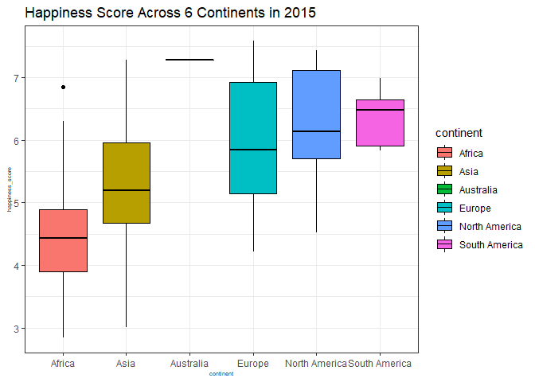
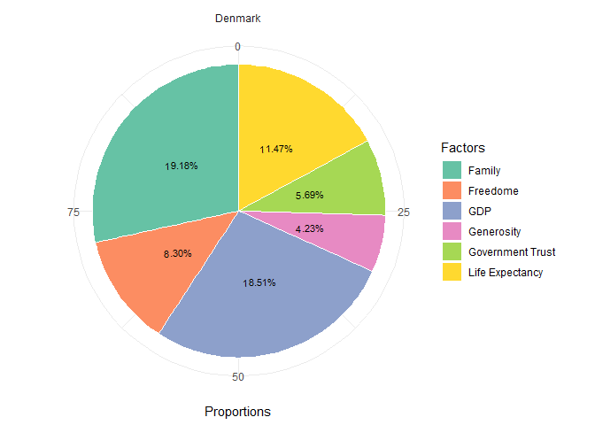
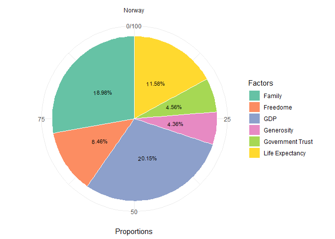
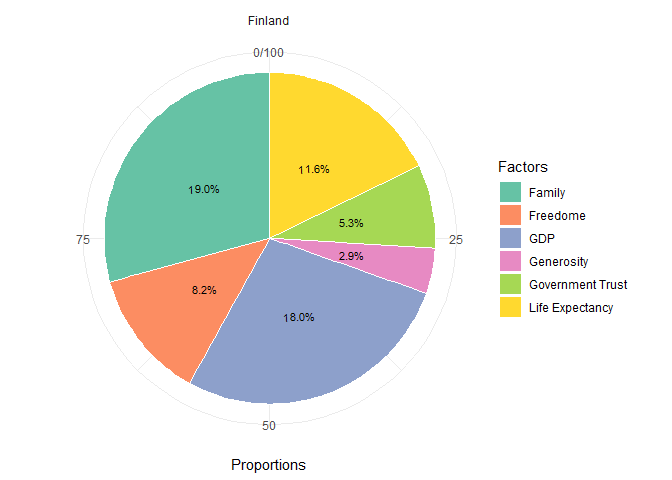
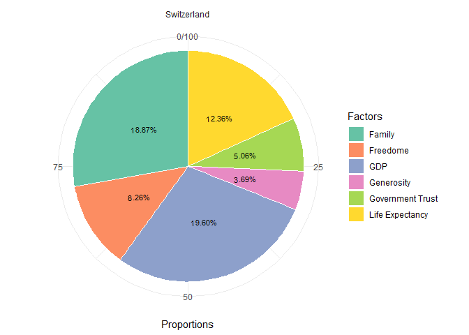
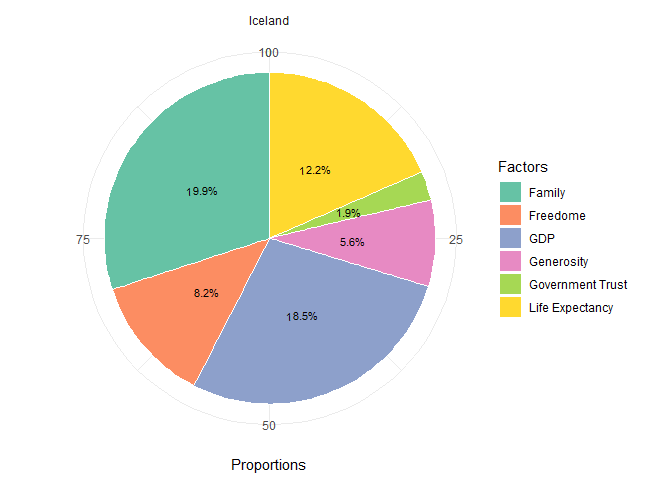

## Introduction 

## Load the libraries

```r
library(ggplot2)
library(ggmap)
library(tidyverse)
library(RColorBrewer)
library(paletteer)
library(janitor)
library(scales)
library(ggthemes)
library(ggVennDiagram)
```


```r
options(scipen=999)
```


## Laod and Clean the Data

```r
happiness_2015 <- readr::read_csv("data/2015.csv")%>% 
  clean_names()
```

```
## Rows: 158 Columns: 12
## -- Column specification --------------------------------------------------------
## Delimiter: ","
## chr  (2): Country, Region
## dbl (10): Happiness Rank, Happiness Score, Standard Error, Economy (GDP per ...
## 
## i Use `spec()` to retrieve the full column specification for this data.
## i Specify the column types or set `show_col_types = FALSE` to quiet this message.
```

```r
happiness_2016 <- readr::read_csv("data/2016.csv")%>% 
  clean_names()
```

```
## Rows: 157 Columns: 13
## -- Column specification --------------------------------------------------------
## Delimiter: ","
## chr  (2): Country, Region
## dbl (11): Happiness Rank, Happiness Score, Lower Confidence Interval, Upper ...
## 
## i Use `spec()` to retrieve the full column specification for this data.
## i Specify the column types or set `show_col_types = FALSE` to quiet this message.
```

```r
happiness_2017 <- readr::read_csv("data/2017.csv")%>% 
  clean_names()
```

```
## Rows: 155 Columns: 12
## -- Column specification --------------------------------------------------------
## Delimiter: ","
## chr  (1): Country
## dbl (11): Happiness.Rank, Happiness.Score, Whisker.high, Whisker.low, Econom...
## 
## i Use `spec()` to retrieve the full column specification for this data.
## i Specify the column types or set `show_col_types = FALSE` to quiet this message.
```

```r
happiness_2018 <- readr::read_csv("data/2018.csv")%>% 
  clean_names()
```

```
## Rows: 156 Columns: 9
## -- Column specification --------------------------------------------------------
## Delimiter: ","
## chr (2): Country or region, Perceptions of corruption
## dbl (7): Overall rank, Score, GDP per capita, Social support, Healthy life e...
## 
## i Use `spec()` to retrieve the full column specification for this data.
## i Specify the column types or set `show_col_types = FALSE` to quiet this message.
```

```r
happiness_2019 <- readr::read_csv("data/2019.csv")%>% 
  clean_names()
```

```
## Rows: 156 Columns: 9
## -- Column specification --------------------------------------------------------
## Delimiter: ","
## chr (1): Country or region
## dbl (8): Overall rank, Score, GDP per capita, Social support, Healthy life e...
## 
## i Use `spec()` to retrieve the full column specification for this data.
## i Specify the column types or set `show_col_types = FALSE` to quiet this message.
```
## Merging Data Frames
**Add year**

```r
# Add year
happiness_2015_join <- happiness_2015 %>% 
  mutate(year = case_when(country != "NA" ~ "2015"))
happiness_2016_join <- happiness_2016 %>% 
  mutate(year = case_when(country != "NA" ~ "2016"))
happiness_2017_join <- happiness_2017 %>% 
  mutate(year = case_when(country != "NA" ~ "2017"))
happiness_2018_join <- happiness_2018 %>% 
  mutate(year = case_when(country_or_region != "NA" ~ "2018"))
happiness_2019_join <- happiness_2019 %>% 
  mutate(year = case_when(country_or_region != "NA" ~ "2019"))
```

**Change column names**

```r
#Change Column names
happiness_2015_join <- happiness_2015_join %>% 
  rename(country_or_region = country)

happiness_2016_join <- happiness_2016_join %>% 
  rename(country_or_region = country)

happiness_2017_join <- happiness_2017_join %>% 
  rename(country_or_region = country)

happiness_2018_join <- happiness_2018_join %>% 
  rename(happiness_rank = overall_rank,
         happiness_score = score,
         economy_gdp_per_capita = gdp_per_capita,
         family = social_support,
         health_life_expectancy = healthy_life_expectancy,
         freedom = freedom_to_make_life_choices,
         trust_government_corruption = perceptions_of_corruption)

happiness_2019_join <- happiness_2019_join %>% 
  rename(happiness_rank = overall_rank,
         happiness_score = score,
         economy_gdp_per_capita = gdp_per_capita,
         family = social_support,
         health_life_expectancy = healthy_life_expectancy,
         freedom = freedom_to_make_life_choices,
         trust_government_corruption = perceptions_of_corruption)
```

**Merge data frames together**

```r
#merge data frames together
#thank you Joel
happiness_2018_join$trust_government_corruption <- as.numeric(happiness_2018_join$trust_government_corruption)
```

```
## Warning: NAs introduced by coercion
```

```r
complete_happiness <- bind_rows(happiness_2015_join, happiness_2016_join, happiness_2017_join, happiness_2018_join, happiness_2019_join) #bind the data frames

complete_happiness <- complete_happiness %>% 
  select(-region, -standard_error, -dystopia_residual, -lower_confidence_interval, -upper_confidence_interval, -whisker_high, -whisker_low) #remove unwanted columns
```

```r
complete_happiness_ave <- complete_happiness %>%
  select(-happiness_rank)%>%
  group_by(country_or_region)%>%
  summarise(mean_happiness_score = mean(happiness_score), 
         mean_gdp_contrib = mean(economy_gdp_per_capita), 
         mean_family_contrib = mean(family), 
         mean_health_contrib = mean(health_life_expectancy), 
         mean_freedom_contrib = mean(freedom), 
         mean_trust_contrib = mean(trust_government_corruption), 
         mean_generosity_contrib = mean(generosity))
```

## Exploring the Data 
**Here, we're interested in understanding what kind of data we're going to be working with by utilizing several functions to observer its structure.**

```r
summary(complete_happiness)
```

```
##  country_or_region  happiness_rank  happiness_score economy_gdp_per_capita
##  Length:782         Min.   :  1.0   Min.   :2.693   Min.   :0.0000        
##  Class :character   1st Qu.: 40.0   1st Qu.:4.510   1st Qu.:0.6065        
##  Mode  :character   Median : 79.0   Median :5.322   Median :0.9822        
##                     Mean   : 78.7   Mean   :5.379   Mean   :0.9160        
##                     3rd Qu.:118.0   3rd Qu.:6.189   3rd Qu.:1.2362        
##                     Max.   :158.0   Max.   :7.769   Max.   :2.0960        
##                                                                           
##      family       health_life_expectancy    freedom      
##  Min.   :0.0000   Min.   :0.0000         Min.   :0.0000  
##  1st Qu.:0.8694   1st Qu.:0.4402         1st Qu.:0.3098  
##  Median :1.1247   Median :0.6473         Median :0.4310  
##  Mean   :1.0784   Mean   :0.6124         Mean   :0.4111  
##  3rd Qu.:1.3273   3rd Qu.:0.8080         3rd Qu.:0.5310  
##  Max.   :1.6440   Max.   :1.1410         Max.   :0.7240  
##                                                          
##  trust_government_corruption   generosity         year          
##  Min.   :0.0000              Min.   :0.0000   Length:782        
##  1st Qu.:0.0540              1st Qu.:0.1300   Class :character  
##  Median :0.0910              Median :0.2020   Mode  :character  
##  Mean   :0.1254              Mean   :0.2186                     
##  3rd Qu.:0.1560              3rd Qu.:0.2788                     
##  Max.   :0.5519              Max.   :0.8381                     
##  NA's   :1
```


```r
glimpse(complete_happiness)
```

```
## Rows: 782
## Columns: 10
## $ country_or_region           <chr> "Switzerland", "Iceland", "Denmark", "Norw~
## $ happiness_rank              <dbl> 1, 2, 3, 4, 5, 6, 7, 8, 9, 10, 11, 12, 13,~
## $ happiness_score             <dbl> 7.587, 7.561, 7.527, 7.522, 7.427, 7.406, ~
## $ economy_gdp_per_capita      <dbl> 1.39651, 1.30232, 1.32548, 1.45900, 1.3262~
## $ family                      <dbl> 1.34951, 1.40223, 1.36058, 1.33095, 1.3226~
## $ health_life_expectancy      <dbl> 0.94143, 0.94784, 0.87464, 0.88521, 0.9056~
## $ freedom                     <dbl> 0.66557, 0.62877, 0.64938, 0.66973, 0.6329~
## $ trust_government_corruption <dbl> 0.41978, 0.14145, 0.48357, 0.36503, 0.3295~
## $ generosity                  <dbl> 0.29678, 0.43630, 0.34139, 0.34699, 0.4581~
## $ year                        <chr> "2015", "2015", "2015", "2015", "2015", "2~
```


```r
complete_happiness %>%
  naniar::miss_var_summary()
```

```
## # A tibble: 10 x 3
##    variable                    n_miss pct_miss
##    <chr>                        <int>    <dbl>
##  1 trust_government_corruption      1    0.128
##  2 country_or_region                0    0    
##  3 happiness_rank                   0    0    
##  4 happiness_score                  0    0    
##  5 economy_gdp_per_capita           0    0    
##  6 family                           0    0    
##  7 health_life_expectancy           0    0    
##  8 freedom                          0    0    
##  9 generosity                       0    0    
## 10 year                             0    0
```

##Venn Diagram

```r
happiness_venn <- complete_happiness_ave %>% 
  mutate(economy_contribution_percentage = mean_gdp_contrib/mean_happiness_score,
         family_contribution_percentage = mean_family_contrib/mean_happiness_score, 
         health_contribution_percentage = mean_health_contrib/mean_happiness_score, 
         freedom_contribution_percentage = mean_freedom_contrib/mean_happiness_score, 
         generosity_contribution_percentage = mean_generosity_contrib/mean_happiness_score, 
         trust_contribution_percentage = mean_trust_contrib/mean_happiness_score, 
         happiness_category = case_when(mean_happiness_score <= 3 ~ "very unhappy",
                                                   mean_happiness_score > 3 & mean_happiness_score <= 5 ~ "unhappy",
                                                   mean_happiness_score > 5 & mean_happiness_score <= 7 ~ "happy",
                                                   mean_happiness_score > 7 ~ "very happy"), 
         economy_category = case_when(economy_contribution_percentage < 0.0833 ~ "insignificant",
                                      economy_contribution_percentage >= 0.0833 ~ "significant"), 
         family_category = case_when(family_contribution_percentage < 0.0833 ~ "insignificant",
                                      family_contribution_percentage >= 0.0833 ~ "significant"),
         health_category = case_when(health_contribution_percentage < 0.0833 ~ "insignificant",
                                      health_contribution_percentage >= 0.0833 ~ "significant"),
         freedom_category = case_when(freedom_contribution_percentage < 0.0833 ~ "insignificant", 
                                      freedom_contribution_percentage >= 0.0833 ~ "significant"), 
         generosity_category = case_when(generosity_contribution_percentage < 0.0833 ~ "insignificant",
                                      generosity_contribution_percentage >= 0.0833 ~ "significant"),
         trust_category = case_when(trust_contribution_percentage < 0.0833 ~ "insignificant",
                                      trust_contribution_percentage >= 0.0833 ~ "significant"))
```


```r
happy_country_vec <- happiness_venn %>%
  filter(happiness_category == "happy" | happiness_category == "very happy")%>%
  pull(country_or_region)
gdp_vec <- happiness_venn %>%
  filter(economy_category == "significant")%>%
  pull(country_or_region)
generosity_vec <- happiness_venn %>%
  filter(generosity_category == "significant")%>%
  pull(country_or_region)
family_vec <- happiness_venn %>%
  filter(family_category == "significant")%>%
  pull(country_or_region)
health_vec <- happiness_venn %>%
  filter(health_category == "significant")%>%
  pull(country_or_region)
freedom_vec <- happiness_venn %>%
  filter(freedom_category == "significant")%>%
  pull(country_or_region)
trust_vec <- happiness_venn %>%
  filter(trust_category == "significant")%>%
  pull(country_or_region)
```


```r
why_happy_list <- list(happy_country_vec, gdp_vec, generosity_vec)
ggVennDiagram(why_happy_list, 
              category.names = c("Happy Country", "GDP", "Generosity"), 
              label_color = "black")+
  ggplot2::scale_fill_gradient(low="navyblue",high = "yellow")
```

<!-- -->
##Pie Charts

```r
happiness_pie <- complete_happiness_ave %>% 
  group_by(country_or_region)%>%
  summarise(economy_contribution_percentage = mean_gdp_contrib/mean_happiness_score,
         family_contribution_percentage = mean_family_contrib/mean_happiness_score, 
         health_contribution_percentage = mean_health_contrib/mean_happiness_score, 
         freedom_contribution_percentage = mean_freedom_contrib/mean_happiness_score, 
         generosity_contribution_percentage = mean_generosity_contrib/mean_happiness_score, 
         trust_contribution_percentage = mean_trust_contrib/mean_happiness_score)%>%
  pivot_longer(-country_or_region, 
               names_to = "factor", 
               values_to = "score_perc")
```


```r
complete_happiness_ave%>%
  arrange(desc(mean_happiness_score))%>%
  head(n=5)%>%
  pull(country_or_region)
```

```
## [1] "Denmark"     "Norway"      "Finland"     "Switzerland" "Iceland"
```

```r
cats <- happiness_pie$factor
cats <- str_replace(cats, c('economy_contribution_percentage'), replacement = 'GDP')
cats <- str_replace(cats, c('family_contribution_percentage'), replacement = 'Family')
cats <- str_replace(cats, c('health_contribution_percentage'), replacement = 'Life Expectancy')
cats <- str_replace(cats, c('freedom_contribution_percentag'), replacement = 'Freedom')
cats <- str_replace(cats, c('generosity_contribution_percentage'), replacement = 'Generosity')
cats <- str_replace(cats, c('trust_contribution_percentage'), replacement = 'Government Trust')
```


```r
happiness_pie2 <- happiness_pie %>%
  mutate(labels = round(score_perc*100, digits = 2))
happiness_pie2$factor = cats
happy_pie1 <- happiness_pie2 %>% 
  filter(country_or_region == "Denmark")%>%
  select(country_or_region, labels, factor)
happy_pie1_2 <- happy_pie1 %>% 
  mutate(pie_prop = labels/sum(happy_pie1$labels)*100) %>% 
  mutate(y_pos = cumsum(pie_prop)-0.5*pie_prop)
```


```r
p1 <- ggplot(happy_pie1_2, aes(x="", y = pie_prop, fill = factor))+
  geom_bar(stat="identity", width=1, color="white") +
  coord_polar("y", start = 0) +
  theme_minimal() + 
  theme(legend.position= "right") +
  guides(fill = guide_legend(title = "Factors"))+
  geom_text(aes(y = pie_prop, label = percent(labels/100)), color = "black", size=3, angle = 2, position = position_stack(vjust = 0.5)) +
  labs(x = "", y= "Proportions")+
  scale_fill_brewer(palette="Set2")+
  facet_wrap(~country_or_region)
```


```r
happy_pie2 <- happiness_pie2 %>% 
  filter(country_or_region == "Norway")%>%
  select(country_or_region, labels, factor)
happy_pie2_2 <- happy_pie2 %>% 
  mutate(pie_prop = labels/sum(happy_pie2$labels)*100) %>% 
  mutate(y_pos = cumsum(pie_prop)-0.5*pie_prop)
```


```r
p2 <- ggplot(happy_pie2_2, aes(x="", y = pie_prop, fill = factor))+
  geom_bar(stat="identity", width=1, color="white") +
  coord_polar("y", start = 0) +
  theme_minimal() + 
  theme(legend.position= "right") +
  guides(fill = guide_legend(title = "Factors"))+
  geom_text(aes(y = pie_prop, label = percent(labels/100)), color = "black", size=3, angle = 2, position = position_stack(vjust = 0.5)) +
  labs(x = "", y= "Proportions")+
  scale_fill_brewer(palette="Set2")+
  facet_wrap(~country_or_region)
```


```r
happy_pie3 <- happiness_pie2 %>% 
  filter(country_or_region == "Finland")%>%
  select(country_or_region, labels, factor)
happy_pie3_2 <- happy_pie3 %>% 
  mutate(pie_prop = labels/sum(happy_pie3$labels)*100) %>% 
  mutate(y_pos = cumsum(pie_prop)-0.5*pie_prop)
```


```r
p3 <- ggplot(happy_pie3_2, aes(x="", y = pie_prop, fill = factor))+
  geom_bar(stat="identity", width=1, color="white") +
  coord_polar("y", start = 0) +
  theme_minimal() + 
  theme(legend.position= "right") +
  guides(fill = guide_legend(title = "Factors"))+
  geom_text(aes(y = pie_prop, label = percent(labels/100)), color = "black", size=3, angle = 2, position = position_stack(vjust = 0.5)) +
  labs(x = "", y= "Proportions")+
  scale_fill_brewer(palette="Set2")+
  facet_wrap(~country_or_region)
```


```r
happy_pie4 <- happiness_pie2 %>% 
  filter(country_or_region == "Switzerland")%>%
  select(country_or_region, labels, factor)
happy_pie4_2 <- happy_pie4 %>% 
  mutate(pie_prop = labels/sum(happy_pie4$labels)*100) %>% 
  mutate(y_pos = cumsum(pie_prop)-0.5*pie_prop)
```


```r
p4 <- ggplot(happy_pie4_2, aes(x="", y = pie_prop, fill = factor))+
  geom_bar(stat="identity", width=1, color="white") +
  coord_polar("y", start = 0) +
  theme_minimal() + 
  theme(legend.position= "right") +
  guides(fill = guide_legend(title = "Factors"))+
  geom_text(aes(y = pie_prop, label = percent(labels/100)), color = "black", size=3, angle = 2, position = position_stack(vjust = 0.5)) +
  labs(x = "", y= "Proportions")+
  scale_fill_brewer(palette="Set2")+
  facet_wrap(~country_or_region)
```


```r
happy_pie5 <- happiness_pie2 %>% 
  filter(country_or_region == "Iceland")%>%
  select(country_or_region, labels, factor)
happy_pie5_2 <- happy_pie5 %>% 
  mutate(pie_prop = labels/sum(happy_pie5$labels)*100) %>% 
  mutate(y_pos = cumsum(pie_prop)-0.5*pie_prop)
```


```r
p5 <- ggplot(happy_pie5_2, aes(x="", y = pie_prop, fill = factor))+
  geom_bar(stat="identity", width=1, color="white") +
  coord_polar("y", start = 0) +
  theme_minimal() + 
  theme(legend.position= "right") +
  guides(fill = guide_legend(title = "Factors"))+
  geom_text(aes(y = pie_prop, label = percent(labels/100)), color = "black", size=3, angle = 2, position = position_stack(vjust = 0.5)) +
  labs(x = "", y= "Proportions")+
  scale_fill_brewer(palette="Set2")+
  facet_wrap(~country_or_region)
```


```r
p1
```

<!-- -->

```r
p2
```

<!-- -->

```r
p3
```

<!-- -->

```r
p4
```

<!-- -->

```r
p5
```

<!-- -->

